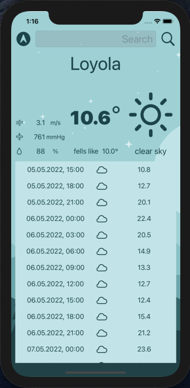

# WeatherAPP
___
## Оглавление
- **[Описание](#Description)**
- **[Презентация](#Presentation)**
- **[В планах сделать](#ToDo)**

## Описание
Погодное приложение. Учебный проект.

- Проект написан на **UIKit**
- Использована стандартная архитектура **MVC**
- Верстка интерфейса **Storyboard**
- Получение данных **REST API** + **Parse JSON**
- Геолокация через **CoreLocation**

___

## Презентация
### Основной экран

### Работа приложения

___

## В планах сделать:
1. Подключить Crashlytics
2. Переписать под MVVm
3. Добавить локализацию

